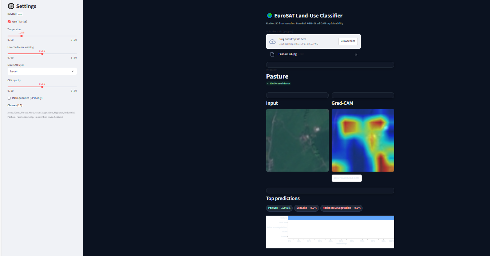
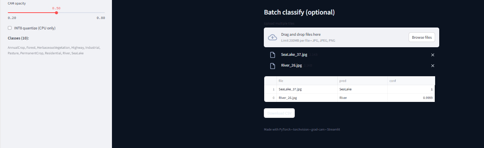

# EuroSAT Land‑Use Classifier (ResNet‑50 + Grad‑CAM)

**Application Streamlit** qui classe des tuiles EuroSAT RGB en **10 classes** et explique les prédictions avec **Grad‑CAM**.  
Jeu de données ≈27k images 64×64. **Accuracy test ≈ 98,7%**.




---

## 🚀 Démarrage rapide (local, sans Docker)

```bash
# Python 3.10 recommandé
python -m venv .venv
# Windows
.\.venv\Scriptsctivate
# macOS/Linux
source .venv/bin/activate

pip install --upgrade pip
pip install -r requirements.txt

# Fichiers requis
#   weights/resnet50_eurosat.pt
#   assets/label2idx.json

streamlit run app.py
# Ouvrir http://localhost:8501
```

---

## 🧭 Utilisation
- **Image unique** : déposez une tuile → prédiction + confiance, **carte Grad‑CAM**, **Top‑5**.
- **Batch** : déposez plusieurs images → tableau + **Download CSV**.
- **Panneau latéral** : **TTA** (flip/rotate), **Température** (calibration), alerte faible confiance, **couche Grad‑CAM** (`layer4`/`layer3`) + opacité, **quantification INT8 (CPU)** optionnelle.

**Classes (10)** : `AnnualCrop, Forest, HerbaceousVegetation, Highway, Industrial, Pasture, PermanentCrop, Residential, River, SeaLake`

---

## 🗂️ Structure minimale du dépôt

```

├─ app.py                         
├─ requirements.txt
├─ weights/resnet50_eurosat.pt
├─ assets/label2idx.json
├─ data/                   
├─ notebooks/EuroSAT_Train.ipynb  

```

---

## 🧠 Modèle 
- **Backbone** : ResNet‑50 pré‑entraîné ImageNet, dernière FC remplacée (10 classes).
- **Eval transforms** : `Resize(256) → CenterCrop(224) → ToTensor → Normalize`.
- **Explainabilité** : Grad‑CAM sur `layer4` (ou `layer3`).

---

## 🐳 Docker 

```bash
docker build -t eurosat-app .
docker run --rm -p 8501:8501 eurosat-app

```

---
